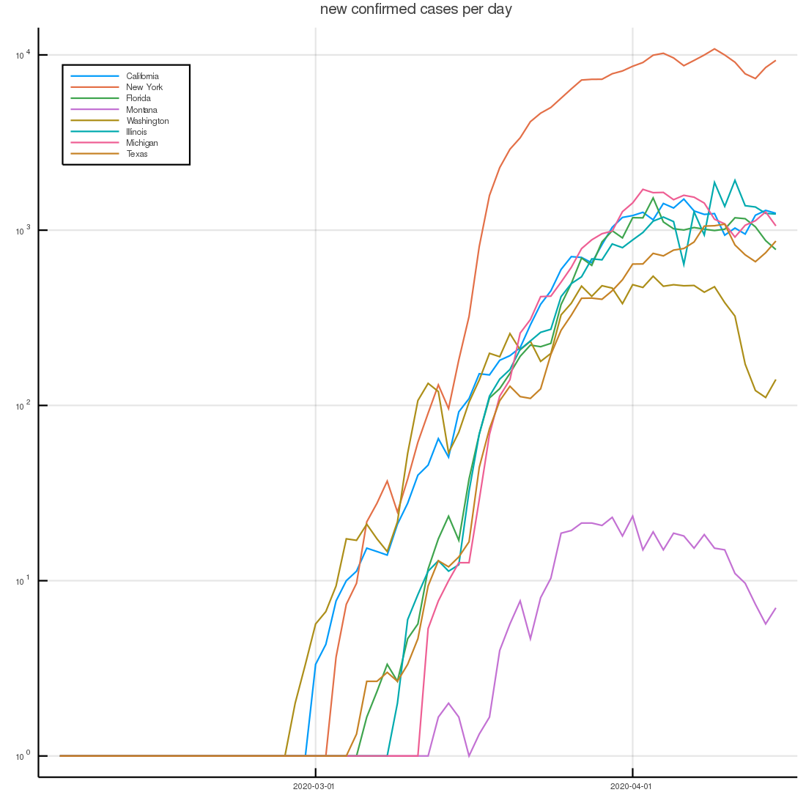
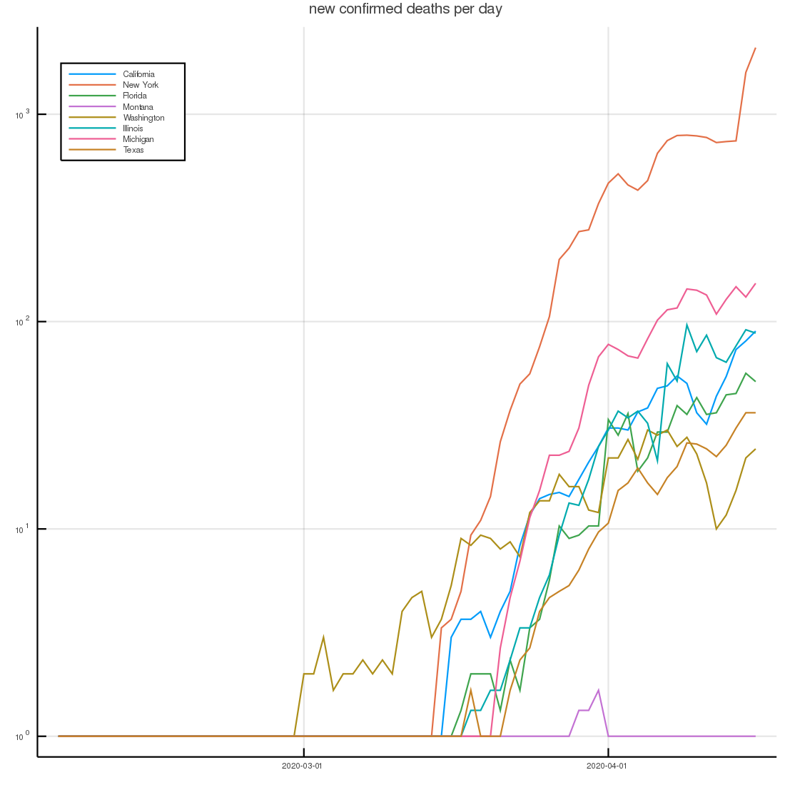

This directory contains a Julia notebook [covid.ipynb](covid.ipynb), that downloads Covid-19 infection data from Johns Hopkins' GitHub site, https://github.com/CSSEGISandData/COVID-19.

The files it pulls are:
* [time_series_covid19_confirmed_US.csv](time_series_covid19_confirmed_US.csv)
* [time_series_covid19_confirmed_global.csv](time_series_covid19_confirmed_global.csv)
* [time_series_covid19_deaths_US.csv](time_series_covid19_deaths_US.csv)
* [time_series_covid19_deaths_global.csv](time_series_covid19_deaths_global.csv)
* [time_series_covid19_recovered_global.csv](time_series_covid19_recovered_global.csv)

It summarizes and plots various aspects of the data. Most of the focus is on the US where it creates statistics on a State level.

